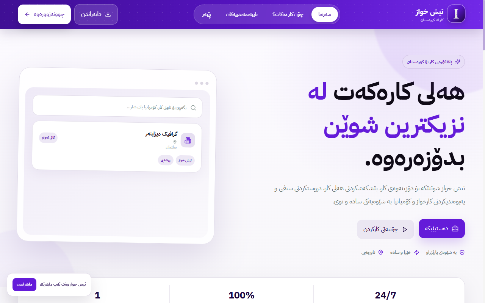
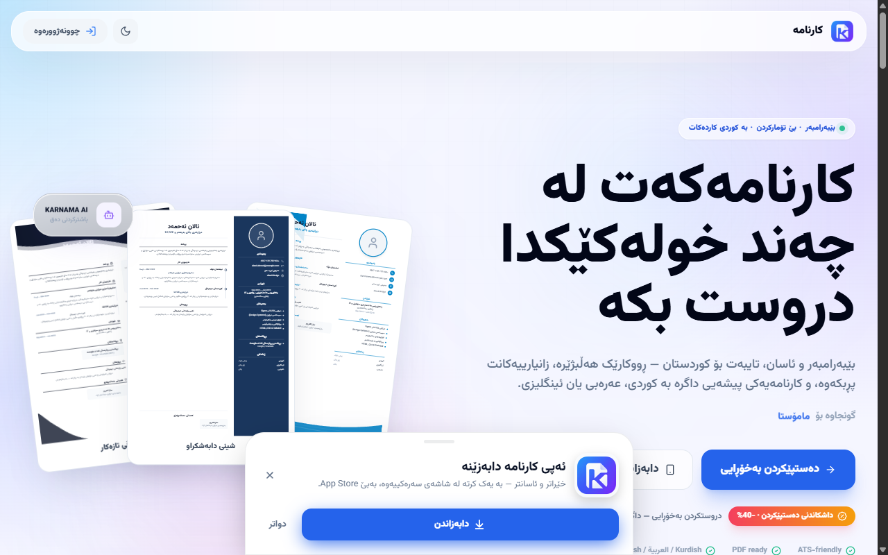
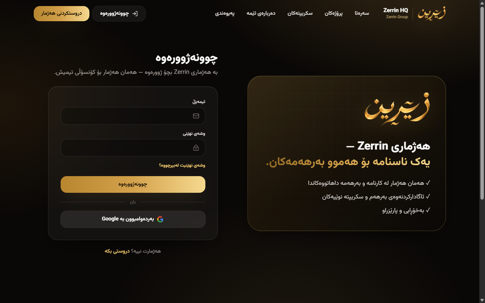
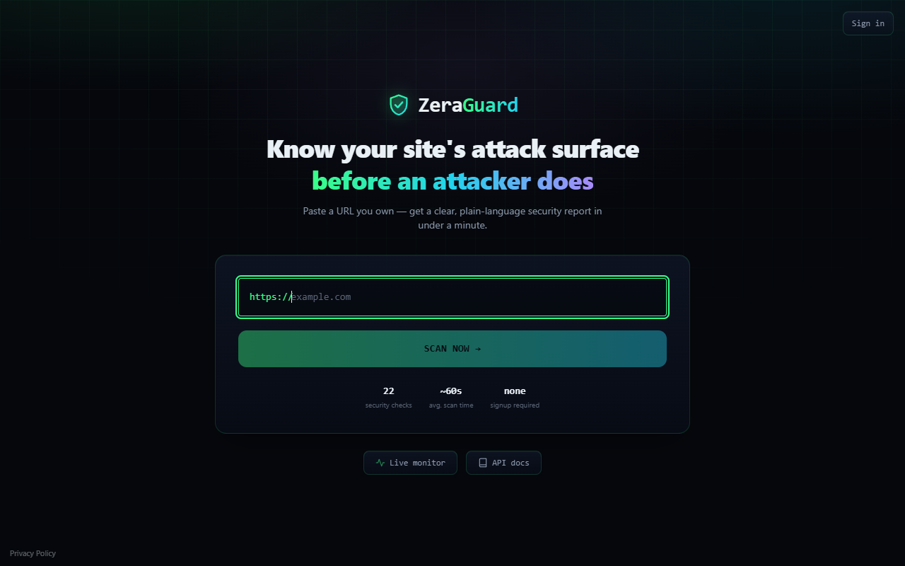

# Arez Bashdar — Founder / Developer

I build and ship full-stack products end to end: web marketplaces, admin
consoles, AI-assisted tools, and security tooling — from database schema to
production deploy.

## Featured work

### [Ish-khwaz](https://github.com/arbmeng/ishkhwaz)
Kurdistan jobs marketplace. React/Vite frontend, PHP/MySQL backend,
real-time updates via Pusher, AI-assisted CV builder, live location map.
Live at [ishkhwaz.zeraworld.com](https://ishkhwaz.zeraworld.com).

### Karnama
AI-assisted CV builder with pay-per-CV pricing and Firebase auth.
Live at [zerrinhq.com/karnama](https://zerrinhq.com/karnama).

### [Zerrin HQ console](https://github.com/arbmeng/zera-console)
Admin console for the Zerrin Group's products (Ish-khwaz, Karnama, and
more), with live data via Pusher. Live at
[zerrinhq.com/console](https://zerrinhq.com/console).

### SiteGuard
Passive, read-only website security scanner: 20+ checks (headers, TLS,
exposed secrets, CORS, subdomain takeover, and more) with a plain-language
report. Live at [guard.zeraworld.com](https://guard.zeraworld.com).

## Stack

React · Next.js · Vite · Node.js · PHP · MySQL · Firebase · Pusher

## Contact

- Email: arbmeng@gmail.com
- Instagram: [@ar.bm58](https://instagram.com/ar.bm58)
- Telegram: [@arbm58](https://t.me/arbm58)
- WhatsApp: [+964 772 306 0909](https://wa.me/9647723060909)
